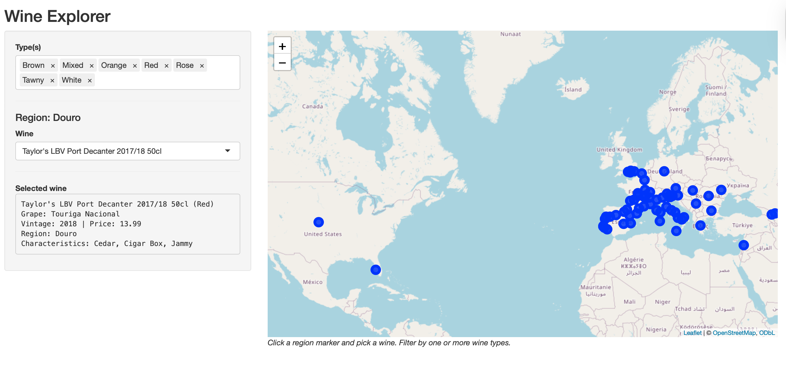

```{r, include = FALSE}
knitr::opts_chunk$set(
  collapse = TRUE,
  comment = "#>"
)
```

## Overview

**vinexplorer** is an R package that ships a Shiny app for exploring wines on an
interactive map. Users can filter by wine type (e.g., red, white, rose), click a region marker, and select an individual wine to see details (grape, vintage, appellation, style, and characteristics).

This vignette shows how to:

- load and standardize the project data,
- filter wines programmatically,
- supply region coordinates for the map,
- launch the Shiny app.

## Installation

```{r, eval = FALSE}
devtools::install_github("Programming-The-Next-Step-2025/wine-explorer")
library(vinexplorer)
```

## Data used by the package

By default, the package expects a CSV at: inst/extdata/WineDataset.csv.

vinexplorer::load_wine_data() standardises the file to 12 columns (in this order): wine_id, wine_name, type, region, country, grape, secondary_grapes, vintage, price, appellation, style, characteristics.

Notes:
- type is normalized to lower-case ("rosé" to "rose").
- vintage tries to extract a year (e.g., "2019/20" to 2019; "NV" to NA).

Load the data:
```{r, eval = FALSE}
df <- vinexplorer::load_wine_data()
str(df)
head(df)
```

## Filtering wines with a function

Use filter_wines() to select by type and optionally country/region.

```{r, eval = FALSE}
# All red and rose
reds_rose <- vinexplorer::filter_wines(df, types = c("red", "rose"))
nrow(reds_rose)

# Whites from Spain
spanish_whites <- vinexplorer::filter_wines(df, types = "white", country = "Spain")
unique(spanish_whites$region)

# All wines from a specific region
rioja <- vinexplorer::filter_wines(df, region = "Rioja")
head(rioja[, c("wine_name","type","grape","vintage")])
```

## Region coordinates for the map

To plot region markers, a CSV is at: inst/extdata/RegionCoordinates.csv, with columns: region, lat, lon.

Load coordinates:
```{r, eval = FALSE}
coords <- vinexplorer::load_region_coords()
head(coords)
``` 

## Launch the Shiny app
```{r, eval = FALSE}
# \dontrun{ 
vinexplorer::run_app()
# }
```

Note: Make sure to open the app in **external** browser. Otherwise, the region markers will not show. 

In the app: 

- You can choose one or more types of wine you are interested in (e.g. only reds). All selected by default. 
- Click a region marker to see different wines from that specific region. 
- Pick a wine and view details, such as grape, vintage, price, appellation, style, characteristics.

## App screenshot

```{r app-screenshot, echo=FALSE, eval=TRUE, fig.cap="Wine Explorer – home screen", out.width="100%"}

```

